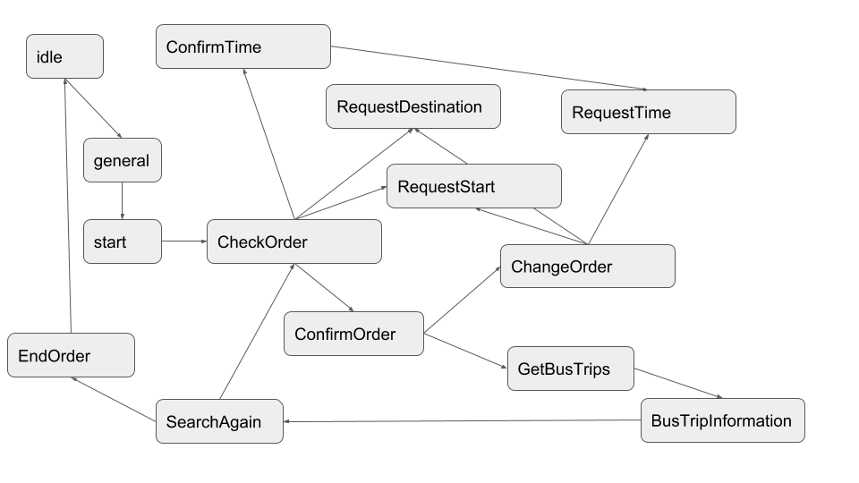

# Furhat travel planner demo

In this repository, we provide a Furhat travel demo that allows users to interact via Furhat with the Umeå public transportation system (https://www.tabussen.nu/).

## Running the skill
Follow the instructions in the [Furhat documentation](https://docs.furhat.io/legacy/skills/#running-a-skill) to run the skill.
Note that you need to import the ``travel_agent``folder you find in the root directory of this repository.
Note that we ``Gen2 Legacy`` version of the Furhat SDK to be compatible with the 1st generation Furhat hardware.

**Note:** If you are reading this "offline", you find the code at https://github.com/TimKam/furhat-demo.

## Interacting with the Furhat travel planner
The following video shows how you can interact with the Furhat travel planner:

**Available in offline version**

The following state diagram depicts possible interaction flows:

## Future work
So far, we have implemented a simple demo to show-case some capabilities of Furhat.
In the future, we plan to implement an advanced travel planner system, in which Furhat employs a set of simple rules to provide facial and verbal reactions to the planned trip, to encourage efficient (fast and cheap) travel and to adjust the scenario to an *internal travel agency* use case for a large organization.
